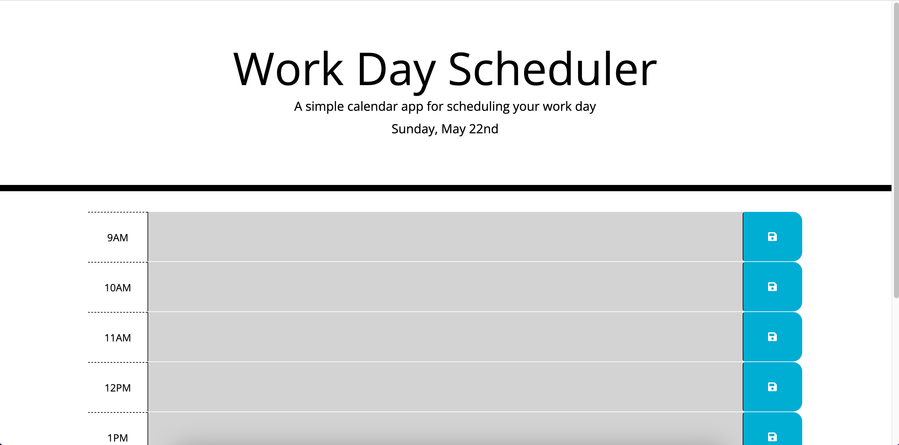

# Work Day Scheduler Starter Code
During this challenge I had the opportunity to learn a lot about 3rd party web api's and learn how to connect different applications together. This is one of the toughest challenges we've had so far, but with the help of my tutor and professor I was able to overcome certain obsticles that were holding me back from progressing. I had to make multiple files in order to accomplish what I wanted to and that was a new experience as well. I was able to build a calendar based on the requirements that we're being asked of. I really enjoyed this weeks challenge because it feels like were getting more into the fun stuff and are learning to make real changes other than creating a website with styling components. Learning more in depth stuff is really progressing my knowledge and helping me understand things I wasn't understanding the previous week. I definitely struggled a lot with javascript, but I can tell I'm understanding it much better than I was a few weeks ago.

Deployed Application: https://colinale.github.io/Web-APIs-Challenge/
Github Repository: https://github.com/colinale/Work-Day-Scheduler

Images: 